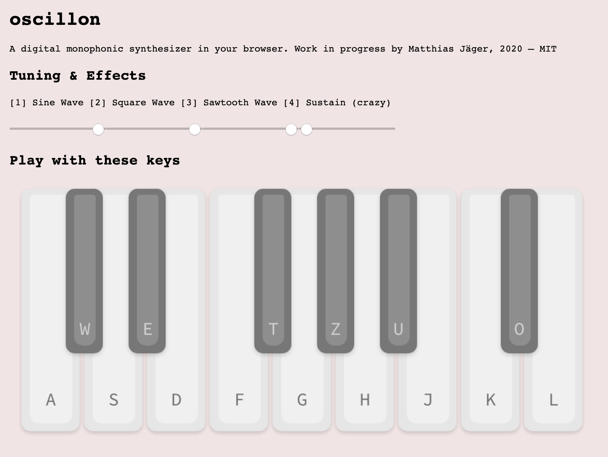
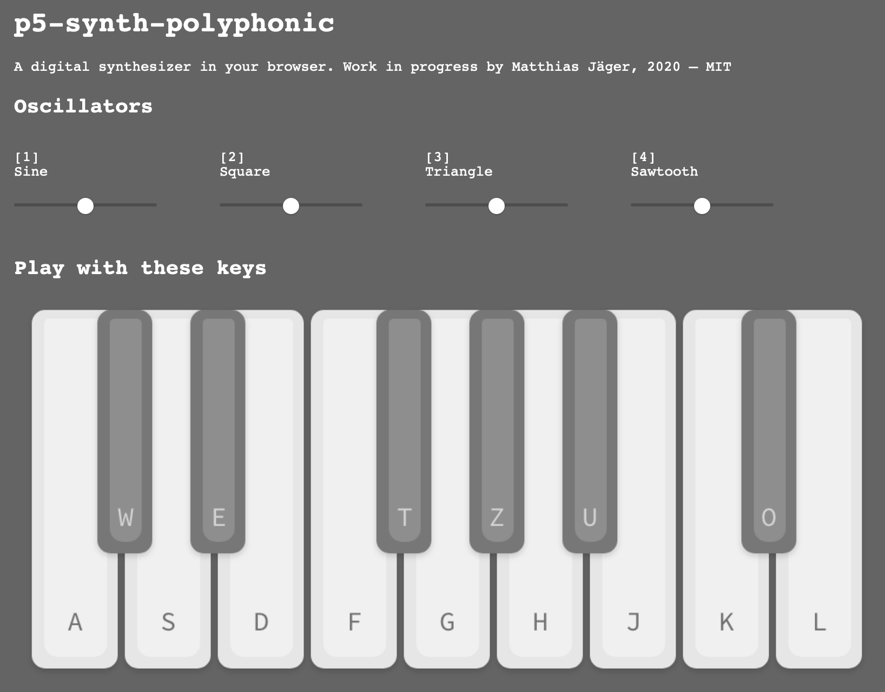
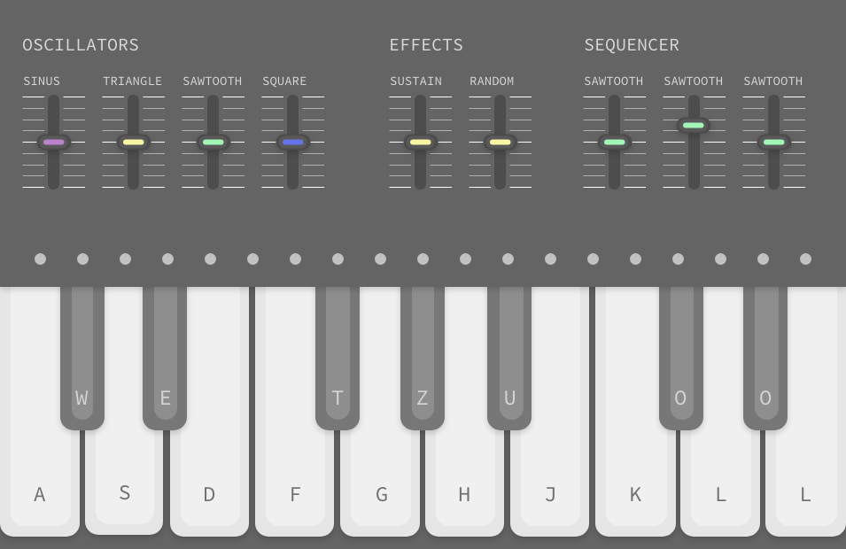

# p5-synthesizer
Interactive synthesizer for the web-browser

## Inital Drafts

### Study monophonic

- Prototype online: https://editor.p5js.org/matthias-jaeger-net/present/ITFhppbIy
- Code: https://editor.p5js.org/matthias-jaeger-net/sketches/ITFhppbIy

### Study polyphonic

Prototype online: https://editor.p5js.org/matthias-jaeger-net/present/x20ayjf88
- Code: https://editor.p5js.org/matthias-jaeger-net/sketches/x20ayjf88

### UI/UX development

